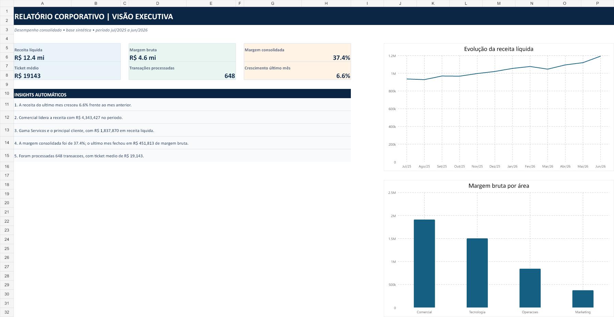

# Gerador de Relatorios Corporativos

Projeto de portfolio que transforma dados mensais ficticios de uma empresa em relatorios prontos para uma reuniao executiva.

O fluxo gera uma base de vendas, processa indicadores com pandas, cria graficos corporativos, monta uma planilha Excel e exporta um relatorio em PDF com insights automaticos.

> Todos os dados sao sinteticos e foram criados apenas para demonstracao.



## Exemplos prontos

- [Relatorio executivo em PDF](outputs/pdf/relatorio_mensal_exemplo.pdf)
- [Planilha Excel com dashboard e abas de dados](outputs/spreadsheets/relatorio_mensal_exemplo.xlsx)

## O que o projeto entrega

- dados mensais de vendas por area, canal, cliente e responsavel;
- KPIs de receita, margem bruta, ticket medio e crescimento;
- graficos de receita mensal e desempenho por area;
- planilha Excel com abas de resumo, desempenho mensal, dados e graficos;
- PDF executivo com indicadores, graficos e recomendacoes;
- insights automaticos sobre crescimento, area com maior receita e clientes relevantes.

## Tecnologias

- Python e pandas para tratamento e analise dos dados;
- matplotlib para graficos corporativos;
- fpdf2 para o relatorio PDF;
- @oai/artifact-tool para a planilha Excel estruturada;
- unittest para testes da regra de negocio.

## Estrutura

```text
data/raw/                  # transacoes mensais sinteticas
data/processed/            # indicadores e agregacoes
docs/preview.png           # amostra visual do relatorio
outputs/charts/            # graficos gerados
outputs/pdf/               # relatorio executivo em PDF
outputs/spreadsheets/      # planilha Excel corporativa
scripts/build_workbook.mjs # construtor da planilha
src/                       # geracao, analise, graficos e PDF
tests/                     # testes automatizados
```

## Como executar

```powershell
python -m venv .venv
.\.venv\Scripts\Activate.ps1
python -m pip install -r requirements.txt
python -m src.pipeline --regenerate
python -m unittest discover -s tests -v
```

Para gerar novamente a planilha Excel, execute o construtor em um ambiente Node com `@oai/artifact-tool` disponivel:

```powershell
node scripts/build_workbook.mjs data/processed outputs/spreadsheets/relatorio_mensal.xlsx
```

## Insights de exemplo

O relatorio identifica automaticamente a variacao de receita frente ao mes anterior, a area mais rentavel, os principais clientes e possiveis pontos de atencao de margem.

## Autor

Victor Dellevedove Ferreira
[LinkedIn](https://www.linkedin.com/in/victor-dellevedove-ferreira-114b34256/) · [GitHub](https://github.com/victordellevedoveferreira)
# gerador-relatorios-corporativos
Pipeline de dados corporativos com pandas, gráficos, planilha Excel e relatório PDF.
